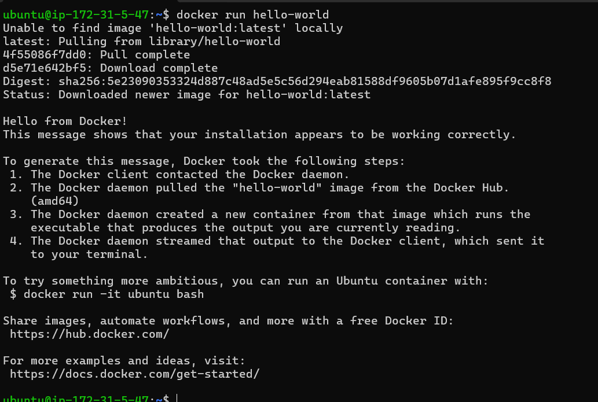
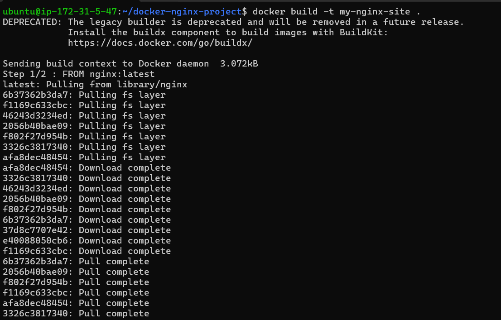
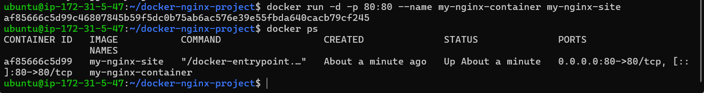
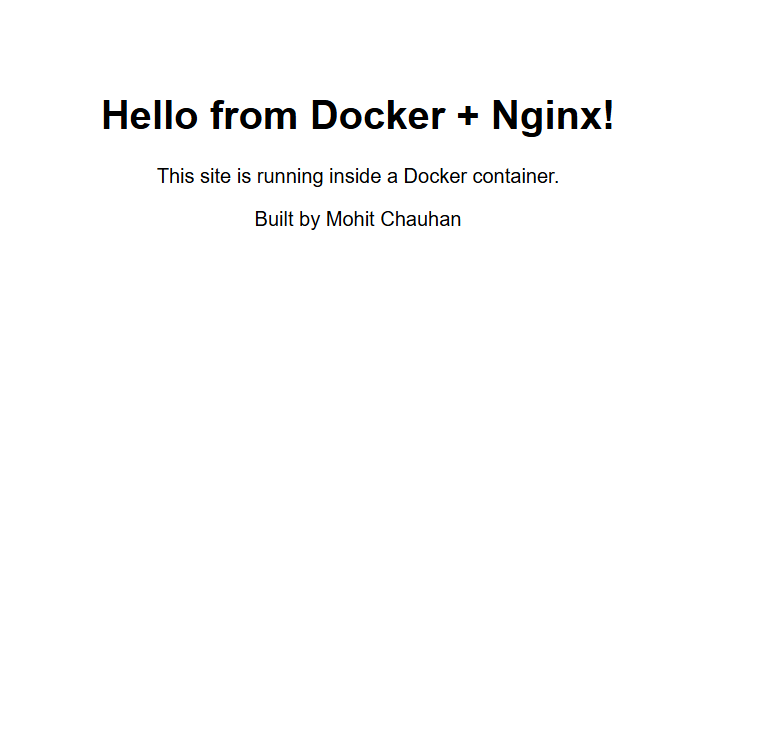
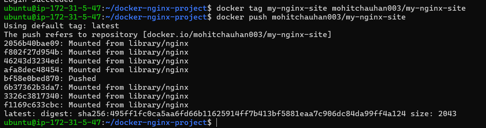
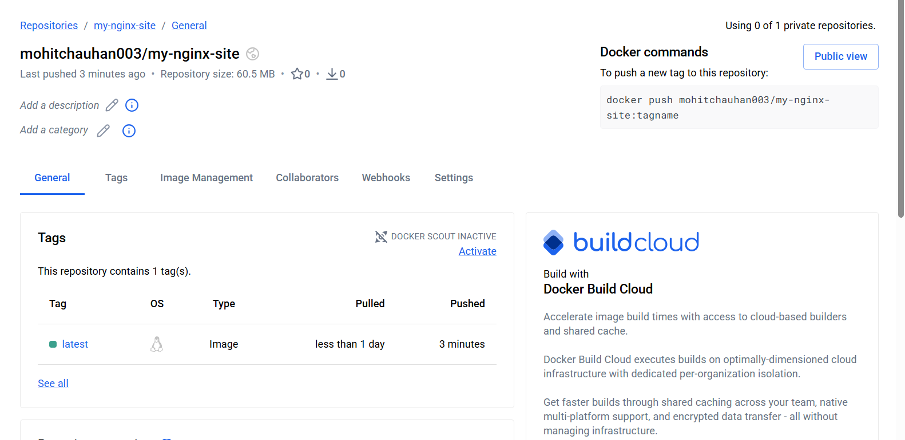
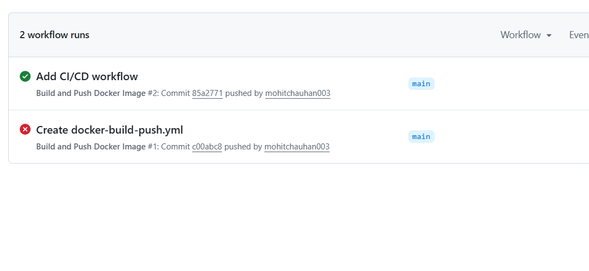
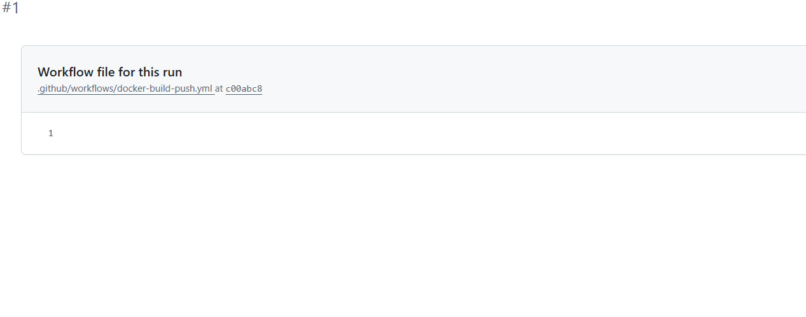
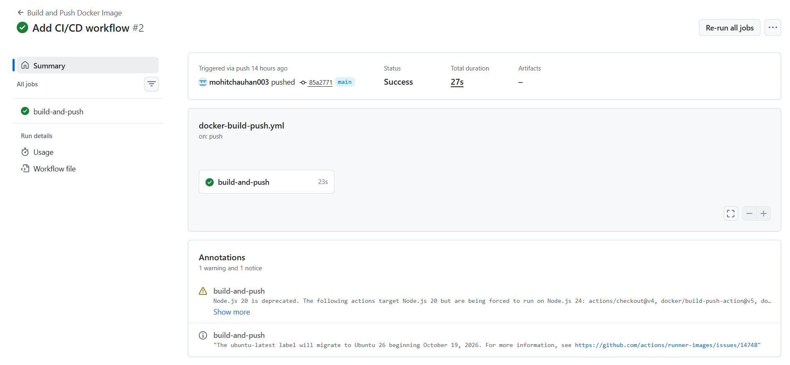
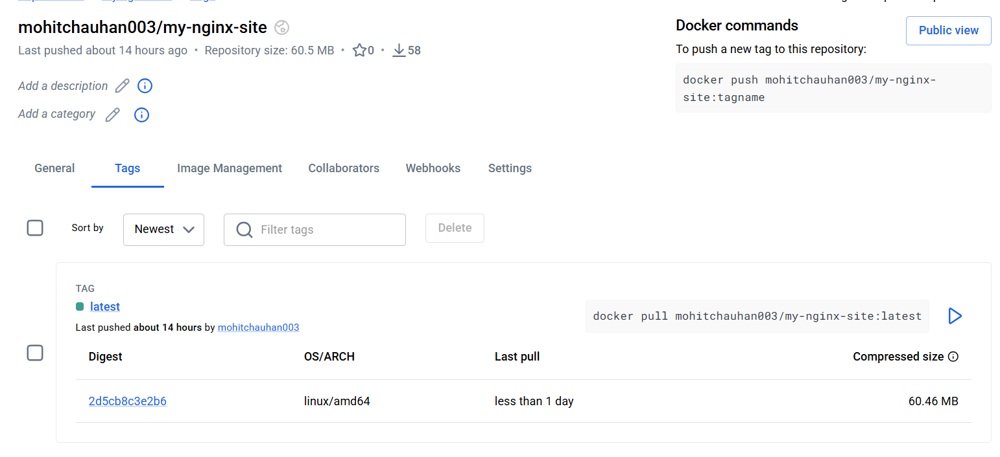

# Dockerized Nginx Site with CI/CD Pipeline

A static website containerized with **Docker**, pushed to **Docker Hub**, and automatically rebuilt and redeployed using a **GitHub Actions** CI/CD pipeline, triggered on every code push.

Built by: Mohit Chauhan

---

## Architecture

```
Code push to GitHub (main)
        │
        ▼
GitHub Actions workflow triggers
        │
        ├─ Checkout code
        ├─ Log in to Docker Hub (using secrets)
        └─ Build Docker image & push to Docker Hub
                │
                ▼
   mohitchauhan003/my-nginx-site:latest (public, pullable by anyone)
```

Separately, the image can be pulled and run on any server with Docker installed:
```
docker pull mohitchauhan003/my-nginx-site:latest
docker run -d -p 80:80 mohitchauhan003/my-nginx-site
```

## What I did

1. **Installed Docker** on an AWS EC2 (Ubuntu) instance.
2. **Wrote a Dockerfile** that uses the official `nginx:latest` base image and copies in a custom `index.html`, instead of installing Nginx directly on the server.
3. **Built and ran the image locally** as a container, mapping port 80 so the site was reachable over the internet.
4. **Pushed the image to Docker Hub**, making it a public, verifiable artifact.
5. **Set up a GitHub Actions workflow** (`.github/workflows/docker-build-push.yml`) that automatically builds and pushes the image to Docker Hub on every push to `main`, using Docker Hub credentials stored securely as GitHub Secrets.
6. **Verified the full pipeline end-to-end**: a push to GitHub triggers the workflow, which rebuilds the image and updates Docker Hub, with no manual Docker commands required.
7. **Documented two real incidents** encountered along the way (see below).

## Dockerfile

```dockerfile
FROM nginx:latest
COPY index.html /usr/share/nginx/html/index.html
```

## GitHub Actions workflow

```yaml
name: Build and Push Docker Image

on:
  push:
    branches:
      - main

jobs:
  build-and-push:
    runs-on: ubuntu-latest

    steps:
      - name: Checkout code
        uses: actions/checkout@v4

      - name: Log in to Docker Hub
        uses: docker/login-action@v3
        with:
          username: ${{ secrets.DOCKERHUB_USERNAME }}
          password: ${{ secrets.DOCKERHUB_TOKEN }}

      - name: Build and push image
        uses: docker/build-push-action@v5
        with:
          context: .
          push: true
          tags: ${{ secrets.DOCKERHUB_USERNAME }}/my-nginx-site:latest
```

## How this differs from a traditional (non-Docker) deployment

In an earlier project, I installed Nginx directly on an Ubuntu server with `apt install nginx`, tying the setup to that one specific machine. Here, Nginx and the website content are packaged together into a single portable **image**, which can run identically on any machine with Docker installed, and is rebuilt and redeployed automatically whenever the code changes, with no manual server configuration required.

## Problems I faced and how I fixed them

### Incident 1: Container stopped
**What I did:** Ran `docker stop my-nginx-container` to simulate the container going down.

**How I detected it:** Refreshed the website in the browser — it failed to load. `docker ps` confirmed the container was no longer running.

**How I fixed it:** Ran `docker start my-nginx-container`.

**How I confirmed the fix:** Refreshed the browser — the site loaded again, and `docker ps` showed the container back in "Up" status.

### Incident 2: First GitHub Actions run failed
**What happened:** The first workflow run, triggered the moment the `.yml` file was created, failed immediately.

**How I diagnosed it:** Opened the failed run in the Actions tab and viewed the workflow file for that specific commit — it was empty, since the file had been created before the YAML content was pasted and committed.

**Root cause:** GitHub Actions triggers on every push to `main`, including the initial empty-file commit, before the real workflow content existed.

**Resolution:** The next commit added the actual YAML content, and the following run succeeded automatically, confirmed by a green checkmark and a verified push to Docker Hub.

**Lesson:** Workflow files are best written completely before the first commit, rather than created empty and edited afterward, to avoid triggering a run against an incomplete file.

## Screenshots

**1. Docker installed and verified**


**2. Docker image build**


**3. Container running**


**4. Website served from the container**


**5. Image pushed to Docker Hub**


**6. Docker Hub repository**


**7. GitHub Actions run history (one failed, one succeeded)**


**7a. First run failure — empty workflow file**


**7b. Successful pipeline run**


**8. Docker Hub updated automatically by the pipeline**


## What I learned

- Building and running containers with Docker: images vs. containers, Dockerfiles, and port mapping
- Publishing images to a public registry (Docker Hub)
- Writing a CI/CD pipeline with GitHub Actions, including using Secrets to keep credentials out of the codebase
- Reading and diagnosing a real pipeline failure by inspecting the exact commit and file state at the time of the run
- How containerized deployment differs from installing software directly on a server
